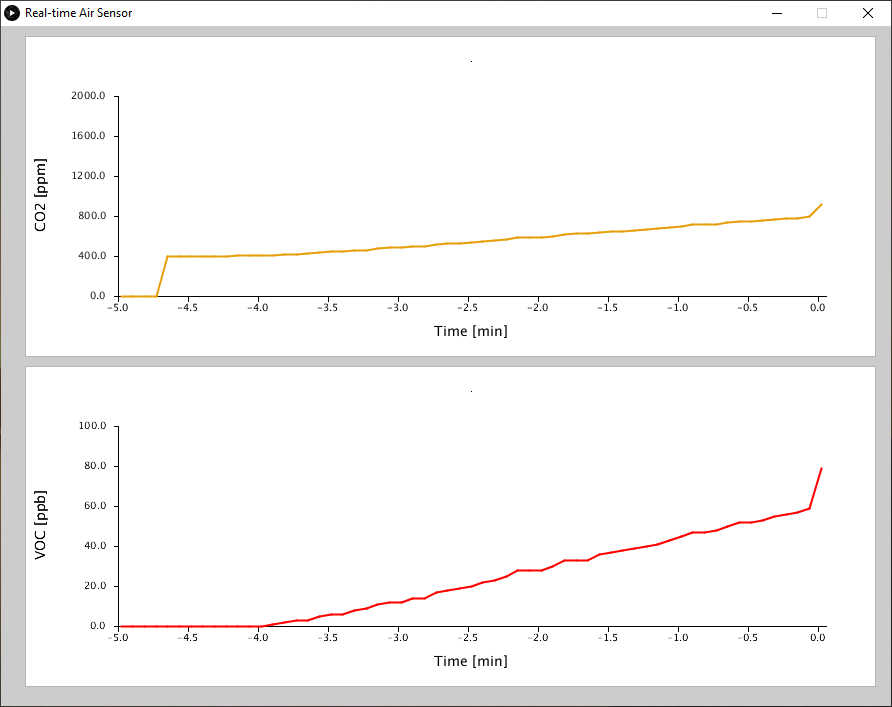

# ArduinoSensorCO2

## Description
Code and schematic to make an Arduino-based air sensor unit, which can work alone or in combination with a PC.
When the CO2 concentration goes above a given threshold, there is a visual alarm.
It can be used, for instance, to determine when a room must be ventilated.

## Air sensor unit
The sensor unit is based on the following components:
* Arduino Uno.
* Sensor CCS 811 (CO2 and TVOC).
* I2C LCD display.
* Two LEDs connect to digital pins 2 and 3.
* Source code in folder [`ArduinoSensorCO2`](/ArduinoSensorCO2).
* Schematics in folder [`Schematic`](/Schematic).

## Real-time data plotter
A simple piece of Processing code is included to plot the data sent by the sensor unit in real time.
The program will search for the sensor, and if it finds it starts plotting CO2 and TVOC.
* Source code in folder [`PCPlotterSensorCO2`](/PCPlotterSensorCO2).
* A compiled version of the code for x64 is included.
